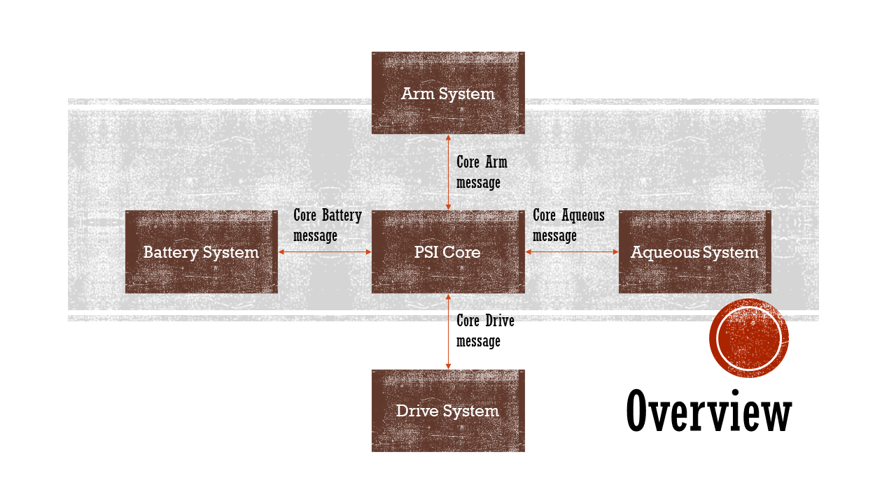
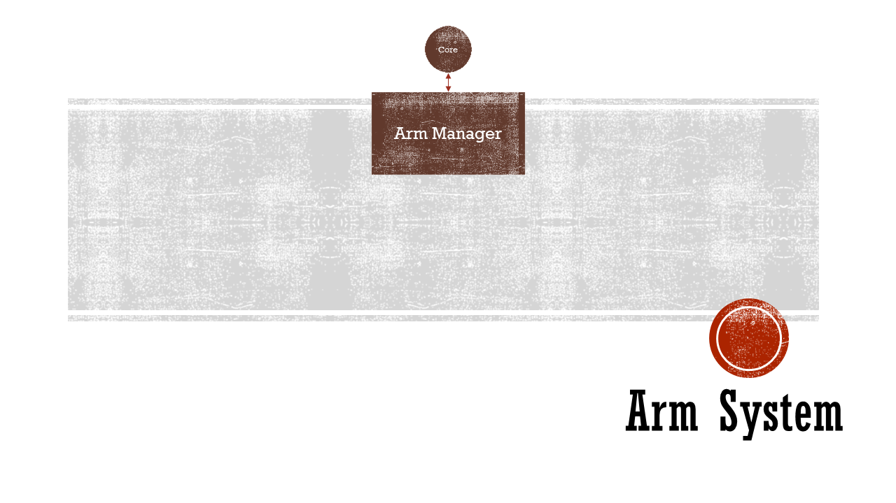
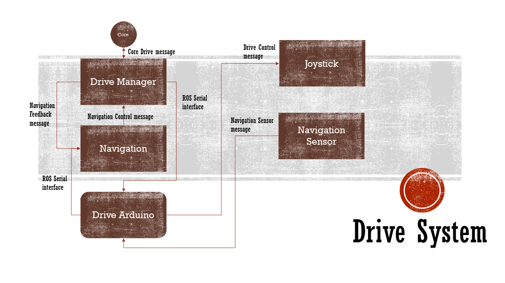

# Overview of the PSI Code Structure

## Subsystems within PSI

- [PSI Core](#psi-core)
- [Arm System](#arm-system)
- [Drive System](#drive-system)
- [Aqueous System](#aqueous-system)
- [Battery System](#battery-system)

## PSI Core

**Overview diagram of the PSI Core**

The core is essentially the supervisor of the system that receives sub-system messages and processes them before sending the messages to the appropriate sub-systems.

## Arm System

**Overview of the arm system**

The arm system consists of the *Arm Manager* and *Arm Control*.

### Arm Manager

This processes messages received from the PSI Core and Arm Control in order to send an appropriate message to the Arm Control to act.

### Arm Control

This will send and receive sensor data from the *Arduino* or *Arm Manager* to operate the servos and dc motors connected to the Arduino.

## Drive System

**Overview of the drive system**

The drive system consists of the *Drive Manager*, *Navigation* and *Drive Arduino*. For *Drive Arduino*, it consists of the **Joystick** output format to control the drive train via the Arduino and the **Sensors** required for navigation such as ultrasound and infrared.

### Drive Manager

This receives messages from the *Navigation* module to process and translate to the appropriate *Joystick* input format for the drive train to understand.
It also sends the message to the Arduino to interface with the drive train.

Moreover, messages received from the *PSI Core* will go through here before appropriate information is to be sent to the appropriate drive sub-systems.

### Navigation

This is the module that receives messages from the sensors attached to the Arduino and processes them to send to the *Drive Manager*.

### Navigation Sensors

This is the Arduino that interface with the various sensors required for navigation such as the ultrasound sensor.

## Aqueous System

`To be updated when the sub-system is created for use`

## Battery System

`To be updated when the sub-system is created for use`
